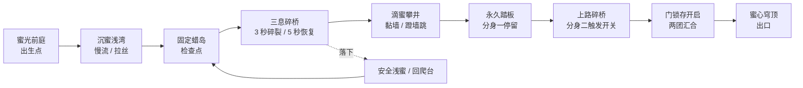

# 第二关 · 琥珀蜜穴

状态：可审阅的关卡与机制设计，尚未实现到游戏。依据用户九张截图中的蜂巢建筑、厚重蜜池、悬空蜂蜡平台与碎片效果设计；截图内字幕、HUD 和水印仅属参考内容。

## 体验目标

从清凉的森林进入温暖、幽深的巨大蜂巢。蓝色史莱姆在琥珀色环境中保持鲜明对比。核心节奏是“被蜂蜜拖住 → 脱离时拉丝 → 在即将碎裂的蜂蜡上及时起跳”。不添加战斗，重点仍是软体角色与环境互动。

主路线约 5,000 世界单位，首玩目标 4—6 分钟；熟练玩家可快速通过。基础视口沿用 1280×720。主体横向前进，攀井段增加约 250 单位的纵向空间；镜头须支持纵向死区跟随，不能把上方落点留在画面外。

## 美术设计

- 主色：蜂蜡浅金 #F6D17B、蜂蜜琥珀 #D88620、厚蜜棕红 #8A4316、洞穴暗部 #392317。少量奶白高光，避免整屏橙色同明度。
- 背景：大小不一的六边形蜂房，部分内部发光；蜂巢列柱、深井雾气、稀疏花粉。近处蜂房有厚壁与暗凹槽，远处降对比形成纵深。
- 永久平台：厚蜂蜡台，下面连着完整蜂巢支柱。边沿偏圆、有少量挂蜜。
- 临时平台：薄蜡盖，下面露出空心六边形骨架；靠形状、裂缝和蜂蜡掉屑识别，不只依赖颜色。
- 蜂蜜：中央透亮、厚边深色、高光宽而柔和；局部气泡缓慢上浮，滴落端先挂出圆鼓蜜滴，再拉成长颈断开。
- 史莱姆：保留蓝色本体，接触处覆盖薄琥珀膜；脸和选中编号始终清楚，不整体染成蜂蜜颜色。

## 路线布局

| 区段 / 横向范围 | 结构与视觉 | 主要操作 | 失败恢复 |
| --- | --- | --- | --- |
| ① 蜜光前庭 / 0—650 | 森林树洞接入蜂巢门厅；厚蜡台与一小滩浅蜜 | 感受黏滞阻力，短跳脱离 | 出生点安全平台 |
| ② 沉蜜浅湾 / 650—1550 | 约 450 单位宽浅蜜池，池中两块固定蜡岛；上方缓慢滴蜜 | 跳入产生厚重隆起，移动拖出沟槽，跳出时拉丝 | 池底可站立，台阶能爬出；出口检查点 |
| ③ 三息碎桥 / 1550—2500 | 三块临时蜡盖，宽 100—130、水平净距 75—100；中途固定休息台 | 学习连续承重 3 秒碎裂、消失 5 秒恢复 | 第一组下方为安全浅蜜与回爬斜台 |
| ④ 滴蜜攀井 / 2500—3300 | 两侧厚蜂巢墙，局部蜜瀑；固定落脚台与一块临时蜡盖交替 | W 攀爬、蹬墙二段跳；蜜帘增加阻力 | 中段固定平台设检查点 |
| ⑤ 双路蜜锁 / 3300—4350 | 下路为永久机关台，上路为窄通道和两块临时蜡盖 | 分裂：一团停在永久踏板打开上路门，另一团通过后触碰锁存开关 | 开关触发后门永久开启，两团可安全汇合 |
| ⑥ 蜜心穹顶 / 4350—5000 | 六边形浮台组成短桥，穿过发光巢室抵达出口 | 综合二段跳与碎桥节奏，最终合并 | 最后一座固定蜡台设检查点 |

关键布局原则：常规跳板不涂减速蜂蜜；需要计时跳跃的位置有干燥起跳面。深蜜和三秒碎桥只在最后一段适量组合，避免输入迟滞与倒计时同时惩罚玩家。两块临时平台之间至少有一条经实测可达的二段跳路径。

## 蜂蜜：明确要做出的动态

| 事件 | 画面 | 操作反馈 |
| --- | --- | --- |
| 静置 | 蜜面缓慢平复，边沿挂壁，有少量慢泡 | 无持续剧烈波纹 |
| 落入 | 接触区凹下，周围鼓起宽厚蜜冠，甩出少量粗滴 | 明显缓冲，不像清水爆出大量小水花 |
| 移动 | 前方堆蜜，后方沟槽延迟填平 | 浅蜜中速度约为干地的 55%—70%，按浸没比例平滑变化 |
| 跳出 | 身体与蜜面拉出 1—3 根蜜丝；细颈拉长后断裂，端部收成蜜滴 | 短暂向下牵引，但仍允许二段跳脱离 |
| 贴墙 | 蜜沿墙缓慢下淌，在平台边缘鼓起再滴落 | 局部蜜膜增大滑动阻力，不封死攀爬路线 |
| 滴蜜入池 | 粗滴融入蜜面，形成迟缓隆起和低频波动 | 不施加突然击退 |

拉丝寿命目标 0.25—0.7 秒，最大可见长度约 100 单位；越细牵引越弱，超过断裂阈值释放。蜂蜜不会吞掉史莱姆粒子，也不会让两个分身因沾蜜自动合并。

离开蜜池后残留蜜膜在约 1 秒内脱落，减速随之消退；不将短时蜂蜜减速永久写入角色基础速度。R 回检查点清除附着与蜜丝状态。

### 实现路线比较与选择

1. 仅给现有水波增加阻尼：成本低，但无法形成蜜冠、粗滴和真实变形边界，不满足本关效果。
2. **采用：局部 PBF 蜂蜜粒子 + 高黏性求解 + 有限寿命黏附约束。** 可复用空间哈希和连续轮廓技术，逐池限制活动粒子，便于与当前主角交互。
3. 全场高分辨率多相流体：表现上限高，但开发与性能风险过大，当前单关没有必要。

主角保留自己的凝聚与弹性恢复；蜂蜜不得使用“向全池质心收拢”的角色约束，否则蜜池会缩成大球。蜂蜜独立使用密度约束、强速度扩散、边界黏附及温和表面张力。黏性需要固定步长或隐式迭代处理，不能通过不受约束地增大显式系数换取“更黏”。

相间接触使用碰撞排斥与相对速度阻力，结合有上限的双向冲量；两种粒子保持独立相。蜜丝使用约束链和连续表面连接，受拉伸后断开。深层静态蜜体可用体积背景补足视觉，但表面、挂滴和角色接触带必须由动态状态驱动。

初始预算：主角维持 441 粒子；可见活动蜜区约 500—900 粒子，远处只保留低频状态。先用单池验证拉丝、堆积和可玩性，再铺设全关。目标桌面 60 FPS，需测量后确认；降低远景与装饰滴蜜开销优先于降低角色精度。

## 临时蜂蜡跳板：3 秒碎裂，5 秒恢复

采用独立状态机，每块平台单独计时，不用全局计时器。时间只在游戏模拟运行时推进，暂停和切出窗口都冻结。

| 状态 | 条件与时长 | 可见效果 | 碰撞 |
| --- | --- | --- | --- |
| 完整 | 无人站立 | 完整浅金蜡盖、空心蜂房支架 | 有 |
| 承重 0—1 秒 | 任意一团真正站在上表面 | 轻微下沉、边缘掉细屑 | 有 |
| 承重 1—2 秒 | 连续占据 | 细裂纹向外扩展，低频嘎吱 | 有 |
| 承重 2—3 秒 | 连续占据 | 明显裂纹、缓慢抖动、闪动边线 | 有 |
| 碎裂 | 连续承重超过 3.0 秒的首个模拟步 | 从接触处裂成蜂蜡块，粉尘与小碎屑下落 | 同一步移除 |
| 缺失 | 从碎裂起计 0—4.5 秒 | 原位置保留淡淡蜂巢虚影 | 无 |
| 重组 | 从碎裂起计 4.5—5.0 秒 | 金色碎粒向原轮廓聚拢，表面渐亮 | 无 |
| 恢复 | 从碎裂起计满 5.0 秒 | 蜡盖完整、裂纹清空 | 恢复单向上表面 |

### 计时边界

- “站立”使用承重接触判定：有稳定向上支撑接触、身体在平台上方；不能由任意两颗擦边粒子启动。
- 跳离后，若平台连续 0.1 秒没有承重接触，承重计时归零；短暂数值接触抖动不归零。离开后的裂纹在 0.4 秒内淡去。
- 两团站在同一块板上，依然是 3 秒，不加速；切换当前控制对象不影响计时。只要仍有一团承重就继续计时。
- 5 秒从碎裂瞬间起算，包含最后 0.5 秒重组，不另加恢复动画等待时间。
- 平台恢复采用单向碰撞：只承托从上方下落的身体。恢复瞬间与身体重叠的粒子先允许穿出，不将史莱姆夹在实体内部、不强制传送；下一次从上方接触正常承托。
- R 或掉落回检查点时，所有临时平台复原、计时归零、旧碎片清空，保证重复尝试一致。

### 碎片效果

每块板碎成约 14—22 块大小不同的蜂蜡多边形，混合 24—40 粒细屑；带向外初速度、重力、随机角速度和弱空气阻力，约 1.2 秒淡出。碎块为视觉粒子，不参与角色碰撞，避免踩到碎片无限续跳。

重组粒子单独从虚影周围聚拢，无需让已掉到深处的全部碎片倒飞回来。恢复轮廓、位置、尺寸必须与原平台相同。碎裂声与高亮预警相互补充，静音时也能看清时机。

## 接入当前游戏

- 将第一关硬编码的地图尺寸、区域、收集物、通关条件和场景美术抽成关卡定义。第一关继续可选，不被第二关覆盖。
- 第一关通关页增加“进入蜜穴”；开始界面可直接选择第二关，方便调试和回玩。
- 第二关使用蜂蜜系统，第一关仍使用现有水系统；进入、重开和退出关卡时清理各自的粒子、状态与碰撞对象。
- 蜜锁开关只放在永久平台上，避免要求玩家在 3 秒平台上停留等待另一团。
- 以用户已熟悉的 C、1/2、点选、二段跳和攀爬为基础，不增加新的必需按键。

## 验收重点

1. 静置蜂蜜不会缩成球、无故喷溅或穿出容器；滴落能形成细颈并断开。
2. 同样的落体冲击下，蜂蜜比第一关水体飞溅更少、恢复更慢、黏附更明显。
3. 角色可稳定进出蜜池，脱离后阻力恢复；分裂、合并、回检查点不残留蜜丝。
4. 跳板在 2.99 秒仍承重、超过 3 秒碎裂；碎裂后 4.99 秒未恢复、满 5 秒恢复。允许一个固定模拟步的误差。
5. 离开、接触抖动、双分身、切换控制、暂停、重开与恢复重叠均有测试。
6. 用真实玩家按键从第二关入口完整通关，验证每组间距、蜜中起跳和机关锁存；不靠传送完成验收。
7. 截图与短帧序列覆盖蜜冠、拉丝、滴蜜、三秒预警、碎裂、五秒重组；记录相应帧耗时。
